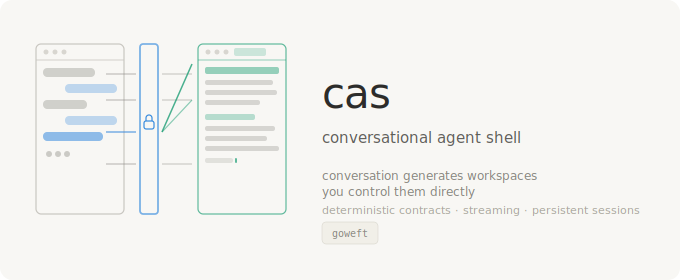

<p align="center"></p>

<h1 align="center">CAS</h1>
<p align="center"><strong>Conversational Agent Shell</strong></p>
<p align="center">
  A shell where conversation generates workspaces and users control them directly.<br>
  Deterministic contracts · streaming generation · persistent sessions
</p>


## See It Work

[](docs/assets/demo.svg)

Each message goes through intent detection — no LLM call, no latency — before a single token streams. The `intent` event fires first. The workspace panel opens as generation begins. When the stream ends, the workspace is created, versioned, and ready to edit directly.

---

## The Idea

Most AI tools collapse into one of two failure modes.

In the first, the AI acts as an **overlay** — a chat window bolted onto existing applications. You ask Copilot to summarize your spreadsheet and it adds a sidebar. The tool didn't change; you just got a new way to talk at it. The underlying friction remains.

In the second, the AI acts as an **agent** — it operates your tools on your behalf. You ask it to book a meeting and it clicks through your calendar. The user is now a passenger. When the agent makes a mistake, you have to figure out what it did and undo it manually.

CAS is a different arrangement. Conversation is for **generating** things. Once generated, you **control** them directly.

You say: *write a project proposal*. A workspace opens alongside the chat — a real, editable panel. You can type in it directly. You can ask CAS to make changes. Both paths work. Neither is subordinated to the other. The AI built the tool. You wield it.

This resolves a debate in HCI that has run since 1997. Ben Shneiderman argued that direct manipulation — clicking, dragging, editing in place — gives users a sense of control that delegation never can. Pattie Maes argued that interface agents, acting on your behalf, reduce cognitive load and handle complexity. They were both right. The conflict is real. CAS addresses it architecturally rather than picking a side: **agents generate, users manipulate.**

---

## How It Works

### Intent detection

CAS classifies every message before any model call:

```
"write a project proposal"   → create workspace (document)
"create a python script"     → create workspace (code)
"add a section about budget" → edit workspace
"edit directly"              → chat (user will type manually)
"hello"                      → chat
```

This runs as pattern matching — no LLM call, no latency. An `intent` event emits before any tokens stream, so the workspace panel opens immediately as generation begins.

`_SELF_EDIT_PATTERNS` are checked before `_EDIT_PATTERNS` — this prevents "edit directly" from being misclassified as an edit request and freezing the session.

### Deterministic contracts

Every workspace operation passes through a contract layer before execution:

```python
contract.check_preconditions(action)        # is this operation permitted?
contract.check_invariants()                 # are all invariants satisfied?
contract.check_postconditions(action, result)  # did the output meet requirements?
```

Contracts are enforced by deterministic Python code external to the model. The model cannot modify, bypass, or reason about them. This addresses a fundamental problem in agent security: LLMs cannot guarantee deterministic behavior. A model that correctly refuses a malicious instruction 99% of the time still permits it 1% of the time. You cannot build provable security on probabilistic foundations.

The approach is based on Bertrand Meyer's Design by Contract (1986), adapted for the agent context.

### Multi-provider model routing

CAS supports two inference backends, selected via `CAS_PROVIDER`:

**Ollama (default)** — local, private, requires GPU:
- Documents and lists → `qwen3.5:9b`
- Code → `qwen2.5-coder:7b`

**Anthropic API** — cloud, no GPU required:
- Documents and lists → `claude-sonnet-4-6`
- Code → `claude-haiku-4-5-20251001`

### Persistence and behavioral learning

Sessions, messages, and workspaces persist across restarts via SQLite (WAL mode). Every workspace edit is versioned — undo is itself undoable.

A Conductor module observes usage patterns and builds a profile that feeds back into the LLM system prompts, progressively adapting the tool to how you work. The profile is visible via the `~` button in the topbar.

---

## Architecture

[](docs/assets/architecture.svg)

CAS is a split-panel web interface that mounts inside [Heddle](https://github.com/goweft/heddle), a local MCP mesh runtime. The left panel holds a persistent conversation. The right panel holds workspace tabs that appear in response to what you say.

Three workspace types, each with its own model, renderer, and editor settings:

- **Document** — markdown prose, serif rendered view, plain-text edit mode
- **Code** — raw files, tab indentation, syntax-appropriate spacing, no spellcheck
- **List** — structured checklists, todo lists, inventories

```
CAS (user-facing shell)
  └── Contracts (deterministic enforcement — Bertrand Meyer's Design by Contract)
       └── Heddle (MCP mesh runtime, local models, audit logging)
```

```
src/cas/
├── shell.py       # Session manager, intent detection
├── workspaces.py  # Workspace lifecycle, three types
├── contracts.py   # Deterministic contract enforcement
├── llm.py         # Multi-provider bridge (Ollama / Anthropic), model routing
├── renderer.py    # HTML rendering: document, code, list
├── conductor.py   # Behavioral learning, user context generation
├── store.py       # SQLite persistence: sessions, messages, workspaces, history
├── api.py         # FastAPI router, SSE streaming
└── static/
    └── index.html # Split-panel UI
```

API:

```
POST /api/cas/message/stream    SSE: session → intent → token×N → workspace? → chat_reply → done
POST /api/cas/session           Create a fresh session
GET  /api/cas/workspaces        List active workspaces
PUT  /api/cas/workspace/{id}    Update workspace content
GET  /api/cas/workspace/{id}/render         Type-aware HTML render
GET  /api/cas/workspace/{id}/history        Edit version list
POST /api/cas/workspace/{id}/undo           Restore previous version
GET  /api/cas/workspace/{id}/export/{fmt}   md / html / txt
GET  /api/cas/profile           Conductor profile + generated context
```

---

## Current State

Working:

- Split-panel UI: conversation left, tabbed workspaces right
- Three workspace types with type-appropriate models, renderers, and editor settings
- Real-time SSE streaming: tokens appear in the workspace as they arrive
- Intent detection: regex-based, fires before generation, no latency
- Full persistence: sessions, messages, workspaces, and edit history in SQLite
- Undo with snapshotting — undo is itself undoable
- Export to markdown, HTML, and plain text
- Code editor: tab indentation, no spellcheck, tighter line spacing
- Behavioral learning: conductor tracks patterns, generates context for prompts
- Profile panel: visible learning state with stats and type breakdowns
- Session management: new session button, history restored on page load
- Ollama cold-start UX: elapsed timer, 30-second warning, cancel button
- Multi-provider model backend: Ollama (default) or Anthropic API

Planned:

- More workspace types: data tables, terminal, code execution with sandboxing
- Multi-user / concurrent session support
- CAS as a login shell / desktop replacement

---

## Quick Start

### With Ollama (local, GPU required)

Install [Ollama](https://ollama.ai), then pull the models:

```bash
ollama pull qwen3.5:9b
ollama pull qwen2.5-coder:7b
```

Start the service:

```bash
sudo systemctl restart loom-dashboard
```

Then open: `http://localhost:8300/api/cas/`

### With Anthropic API (no GPU required)

```bash
export CAS_PROVIDER=anthropic
export ANTHROPIC_API_KEY=sk-ant-...
sudo systemctl restart loom-dashboard
```

Or set in the systemd unit drop-in:

```
Environment=CAS_PROVIDER=anthropic
Environment=ANTHROPIC_API_KEY=sk-ant-...
```

### Development

```bash
cd ~/projects/loom
source venv/bin/activate
CAS_PROVIDER=anthropic ANTHROPIC_API_KEY=sk-ant-... python heddle_dashboard.py 8300
```

### Tests

```bash
cd ~/projects/cas
python -m pytest tests/ -q
```

---

## References

Shneiderman & Maes (1997). "Direct Manipulation vs. Interface Agents." *Interactions, 4(6).*

Meyer (1988). *Object-Oriented Software Construction.* Prentice Hall. (Design by Contract)

Norman (1986). "Cognitive Engineering." In *User Centered System Design.* (Gulf of Execution/Evaluation)

Horvitz (1999). "Principles of Mixed-Initiative User Interfaces." *CHI '99.*

Dennis & Van Horn (1966). "Programming Semantics for Multiprogrammed Computations." *CACM.*
